# Retirement planner UI review — September 7, 2026

Reviewed the current local development application after the accuracy work, using the Codex in-app browser. The goal was to test the path from adjusting an assumption to inspecting graphs and detailed results. This is a UI review, not another certification of the financial calculations.

## Verdict

The planner already has the essential live calculations, paired sliders/numeric inputs, comparison matrix, Monte Carlo analysis, and detailed reporting. Its information order and form layout make those capabilities harder to use than necessary. The highest-priority improvement is a dashboard that brings quick controls and graphs together, while providing a spacious, indexed settings editor and direct access to the complete yearly report.

## Captured flow

### 1. Initial entry — obstructed

At the browser's initial narrow size, the expanded AI assistant covered most of the dashboard. At desktop size, the first screen contained metrics and multiple long notices before the main chart. The notices are useful, but their current arrangement delays the primary experiment-and-observe workflow.

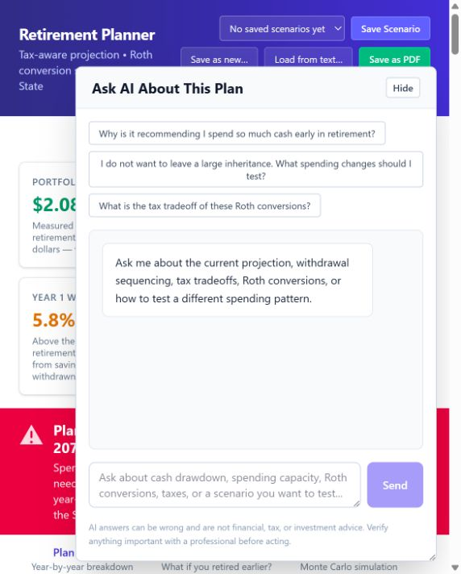

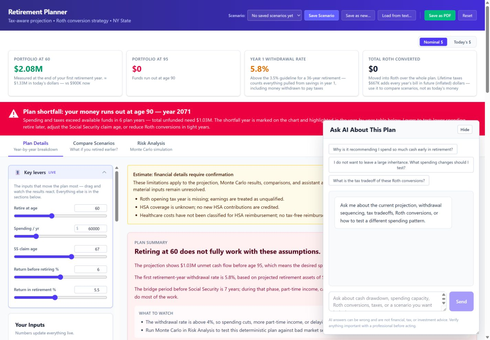

Collapsing the assistant made the page usable, but its remaining bar still overlapped lower-right content. Preserve the assistant and start it collapsed with a smaller opener.

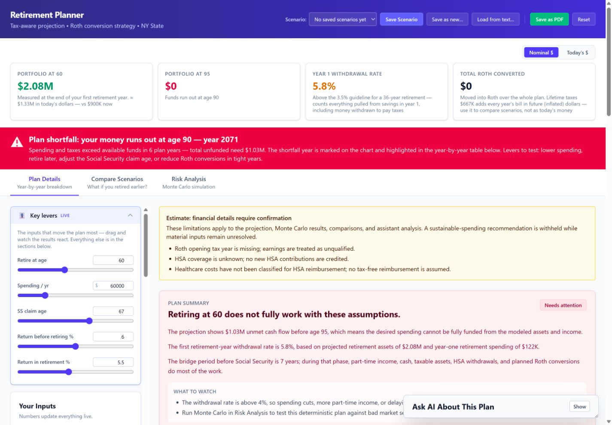

### 2. Live spending experiment — works, with room for clearer feedback

At desktop size, scrolling brings the portfolio graph alongside sticky key controls. This is a good existing pattern to retain. Changing annual lifestyle spending from $60,000 to $60,500 updated the main graph, withdrawal rate (5.8% to 5.9%), and first shortfall age (90 to 89) immediately. Restoring $60,000 restored the prior displayed results. No Run action was needed.

The spending quick-control label does not say that it excludes healthcare or that the input is in today's dollars. The full spending setting does provide this context. Add consistent units and meaning to quick controls, and provide baseline/restore feedback for repeated experiments. Avoid layout movement during edits.

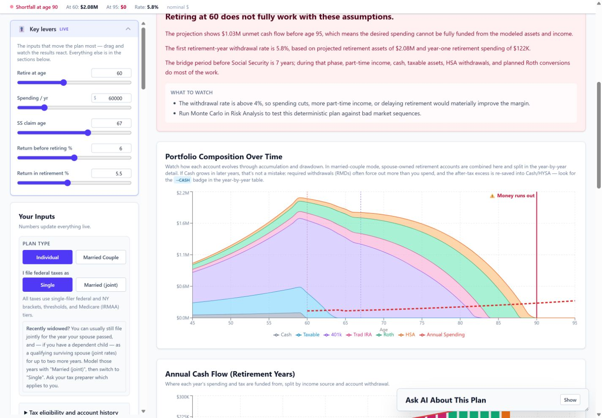

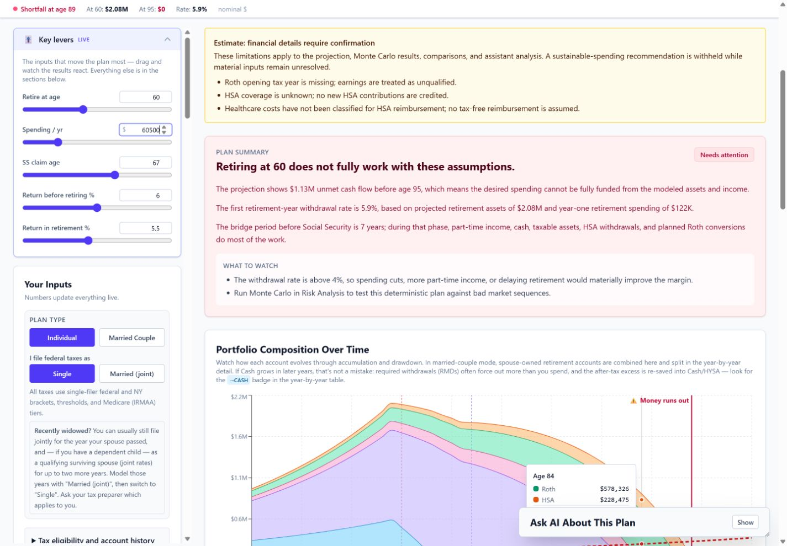

### 3. Financial eligibility and account history — present but cramped

Opening the eligibility disclosure exposes the newly added financial details. At desktop width, two form columns are squeezed into a roughly 300-pixel sidebar. Labels wrap into several short lines. The sticky quick-control block consumes much of the visible sidebar height. The unresolved-input notice identifies missing facts but does not offer a direct action to the appropriate fields.

Give these fields a wider editor, named subgroups, and direct links from unresolved-input notices. Do not substitute defaults for unconfirmed facts.

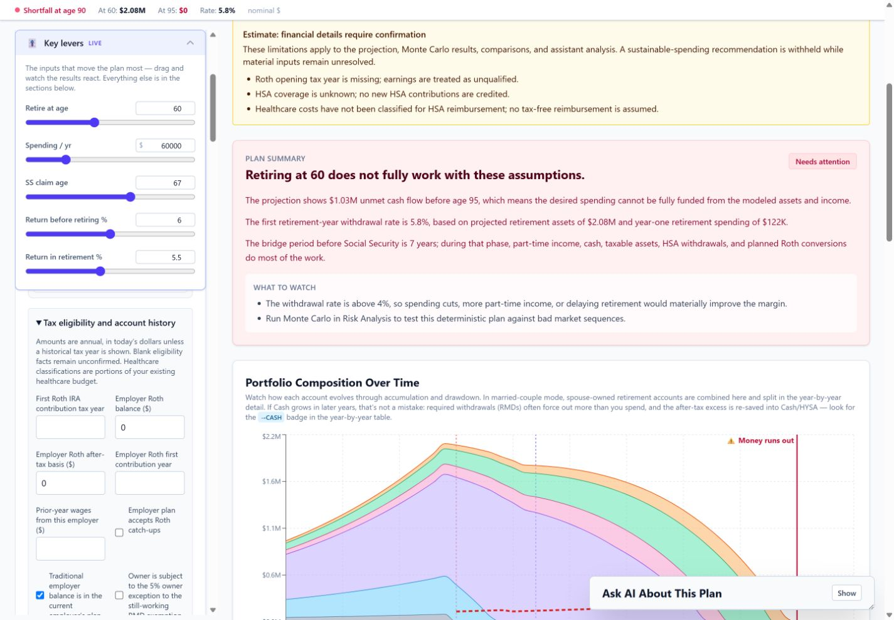

### 4. Scenario comparison — functional and clearly structured, limited scope

The Compare tab shows a matrix of retirement ages and spending levels, with ending portfolio values and a corresponding chart. It does not compare arbitrary saved named scenarios. Clarify this scope in navigation or subtitles while retaining the matrix and explanations.

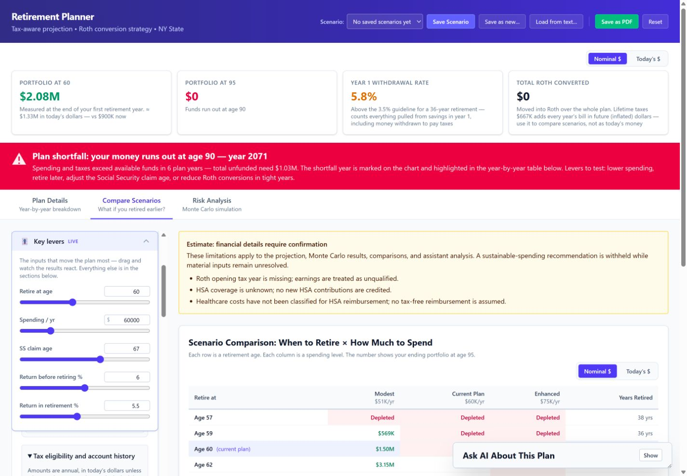

### 5. Risk analysis — run and stale states work; diagnosis context needs alignment

Running 500 simulations displayed a disabled running button and then completed with results. Changing annual spending afterward produced a rerun button, stale warning, and dimmed results. Preserve these distinctions: deterministic charts update live; stochastic risk results require a rerun.

A presentation inconsistency remains: the stale result keeps its prior 28.0% success percentage, but the diagnosis changes its withdrawal-rate discussion to the new 5.9% value. Diagnosis should use the same input snapshot as the displayed risk result, or be withheld until rerun. The stale warning was above the viewport in the scrolled capture, which strengthens the case for a nearby status label.

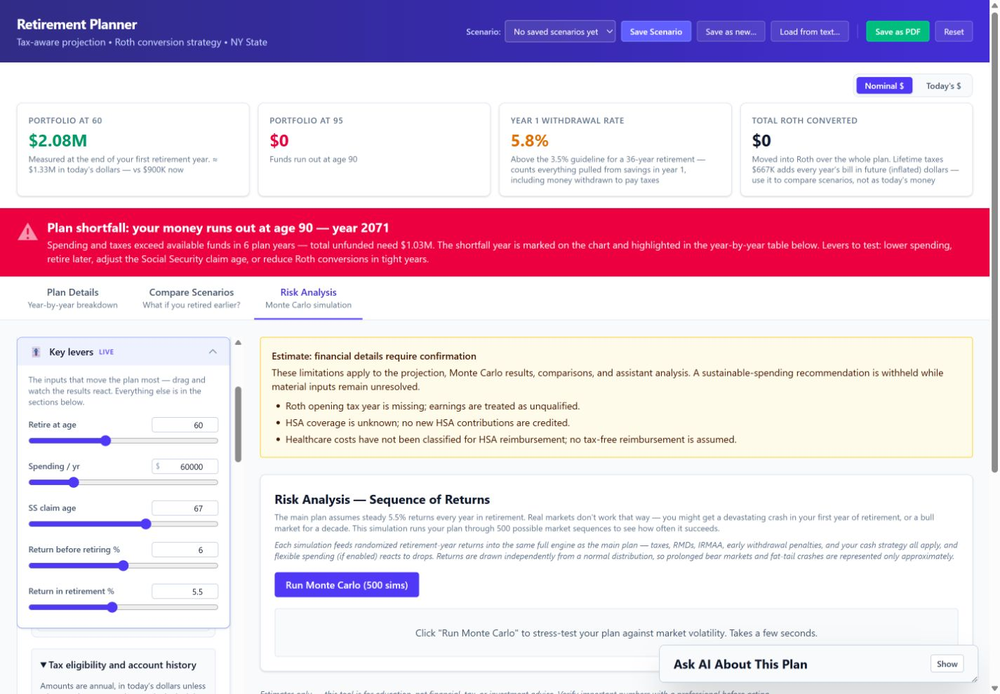

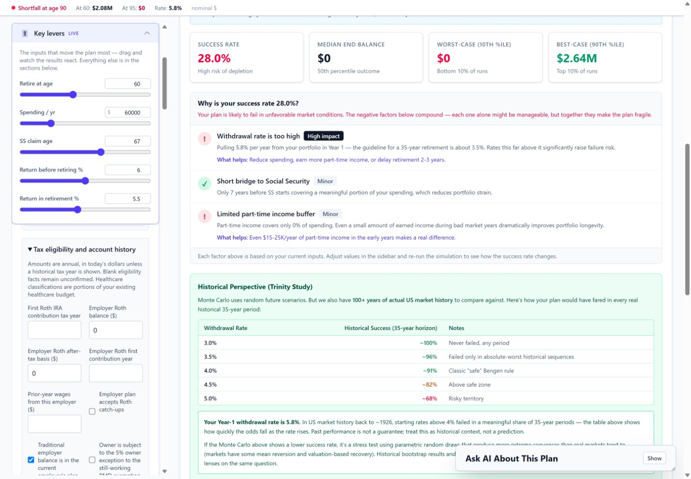

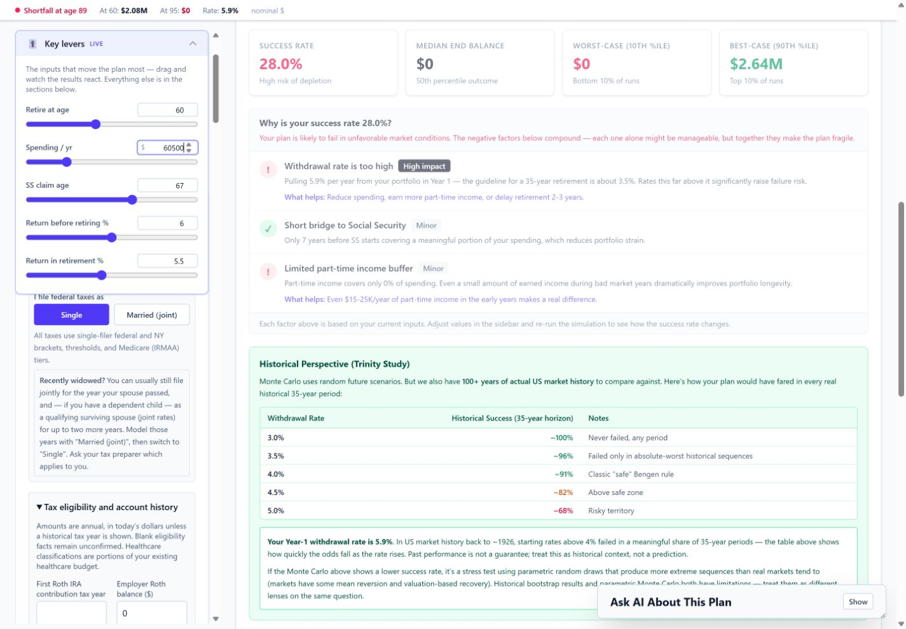

### 6. Couple planning — available, with important ownership distinctions

Switching to Married Couple exposes separate retirement-age controls and Household, Primary, and Spouse settings. The warnings also identify the affected owner. Preserve those distinctions and all per-person conditional settings. The current sidebar remains dense. Switching back to Individual restored the observed individual values for this default-data review.

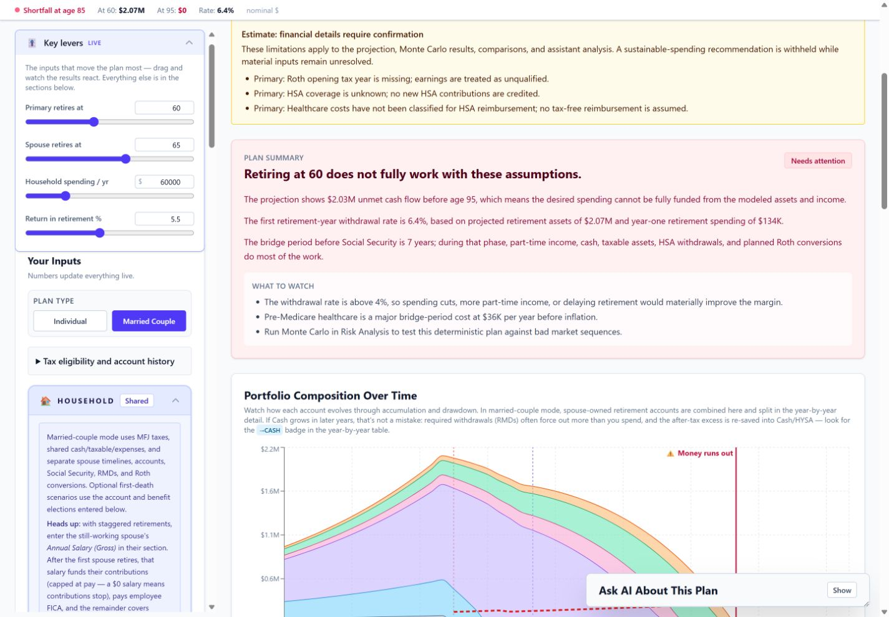

### 7. Phone layout — major navigation friction

At 390 x 844, header actions wrap beside a narrow title, and metric explanations become tall cards. The input form precedes results. The portfolio-chart heading was approximately 7,749 pixels from the top of the document in the observed individual state, even with the eligibility disclosure closed. This prevents a convenient phone-sized edit-and-observe loop.

Put the main graph and compact quick controls before full settings. Provide an obvious All settings view and direct report navigation. Do not remove controls or columns to make the page fit.

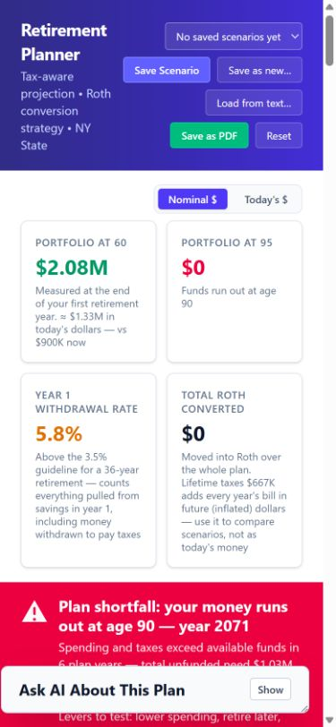

### 8. Year-by-year detail — rich output, difficult to reach and scan

The report retains all account columns, grouped headers, shortfall badges, and dollar-basis controls. It requires horizontal scrolling even at desktop size because the sidebar consumes part of the available width. Offer a direct full-width detail destination and a visible row identifier while scrolling. Preserve every column and print behavior.

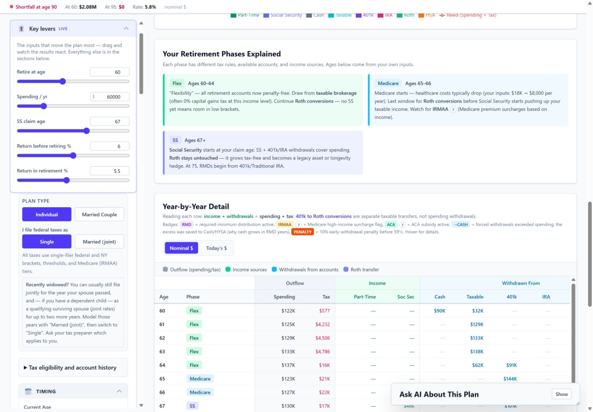

### 9. Settings import and scenario save entry — import opens; save not verified

The settings import dialog opens and focuses its textarea. Empty submission is disabled and Cancel closes it. Pressing Escape did not close it in this run. Retain import behavior and add complete keyboard dismissal/focus management.

Clicking Save as new did not produce a visible naming dialog or a saved scenario in this browser run. The existing source uses a native prompt. Saving, renaming, deleting, persistence across reload, and the PDF dialog require additional end-to-end verification during implementation; they are not claimed to pass here. No user scenario was overwritten or deleted.

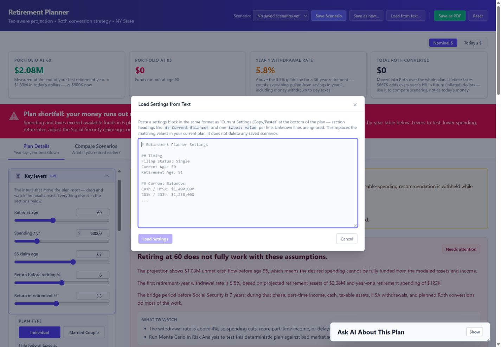

## Accessibility observations

- The 39 exposed individual numeric controls in the collapsed-eligibility state had no associated label or aria-label/aria-labelledby. Visible text labels exist, but the accessibility tree exposes unnamed spinbuttons. The new eligibility fields correctly use wrapping labels.
- Several legacy term-help elements use aria-hidden spans and pointer interaction, so their explanations need keyboard-accessible controls.
- The import dialog's Escape dismissal did not work in the observed flow.
- Dense small text, narrow form columns, and fixed overlays make reading and focus tracking harder. Formal contrast measurement, screen-reader operation, and full keyboard traversal were not completed. This review does not assert WCAG compliance.

## Baseline verification

Before any UI implementation, `npm test` passed 31/31 tests, including the production diagnostics test; `npm run lint` passed; `npm run build` passed. Build output reported existing Vite/plugin deprecation notices and a large-chunk warning. These checks establish a baseline, not independent financial correctness.

No application source was changed during this review. The local development server used `http://127.0.0.1:5173/`. Tests used the app's default scenario inputs; no financial information was transmitted to an AI backend. Screenshots were saved from the live browser in this run.

## Proposed next step

Implement the dashboard and detailed-settings design in `docs/superpowers/specs/2026-09-07-dashboard-ui-design.md` after the required design approval. Preserve the financial engine, all conditional inputs and reports, the existing scenario serialization, and the audit's conservative treatment of unresolved facts. Repeat this flow after implementation and verify print and scenario persistence as well.
